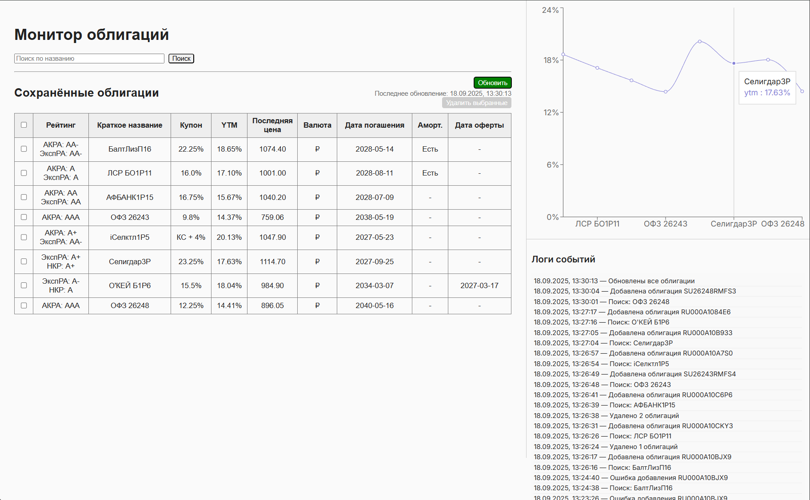

## Broker Monitor
Проект представляет собой веб-приложение для поиска, добавления и мониторинга облигаций с историей событий.

## 📐Архитектура
- Backend: FastAPI, SQLAlchemy, Alembic, Pydantic, PostgreSQL
- Frontend: React (Create React App) c hot‑reload
- Оркестрация: Docker Compose

#### Возможности
- Поиск облигаций по MOEX через API, при необходимости парсинг данных с corpbonds.ru
- Сохранение облигаций в локальную базу данных
- Удаление и массовое обновление данных по облигациям
- Динамический график цен
- Логи действий пользователя, сохраняемые в базе

## 🚀 Быстрый старт
1. Клонировать репозиторий
2. Настроить переменные окружения (/.env)

| Переменная        | Назначение | Пример          |
|------------|---------|----------------|
| DATABASE_URL       | DSN для подключения к Postgres      | postgresql+asyncpg://bonds_user:secretpass@db:5432/bondsdb         |
| POSTGRES_USER | пользователь Postgres | bonds_user |
| POSTGRES_PASSWORD | пароль пользователя | password |
| POSTGRES_DB | БД в Postgres | bondsdb |
| REACT_APP_API_URL       | Базовый URL API (для фронтенда)      | http://localhost:8010|
| DEV_MODE | режим разработки | true |
| CHOKIDAR_USEPOLLING | режим библиотеки chokidar (перечитывание каталогов) | true |


3. Запустить через Docker Compose  `docker compose up --build -d`
4. Открыть приложение 
- Frontend: http://localhost:3000
- Backend Swagger UI: http://localhost:8010/docs


## 🔹 Потоки данных
- Браузер → Backend (8000) Backend в dev‑режиме проксирует запросы на frontend:3000 для SPA‑маршрутов и обрабатывает API‑запросы.
- Backend → Frontend Проксирование статики и страниц React dev‑сервера.
- Backend → DB Запросы к PostgreSQL через SQLAlchemy.
- Backend → Alembic При старте генерирует и применяет миграции.
- Frontend → Browser Отдаёт собранный React‑код с hot‑reload.


### 📊  API Endpoints
#### Облигации
- GET /bonds
- POST /bonds
- DELETE /bonds
- PUT /bonds
#### Поиск
- GET /search_bonds?query={SECID или часть названия}
#### Логи
- GET /logs
- POST /logs
### 🔄 Модель данных
| Таблица          | Ключи          |
|---------------------|----------------|
| Bond        | id, secid, isin, name, emitent, market, coupon, coupon_display, coupon_type, maturity_date, ytm, ytm_date, last_price, amortization, offer_date, akra_rating/forecast, raexpert_rating/forecast, nkr_rating/forecast, currency, currency_symbol, updated_at     |
| Price             | id, bond_id, date, value|
| EventLog           | id, timestamp, message         |

### Логи и отладка
FastAPI логирует запросы на уровне INFO

Для отключения DEBUG-сообщений от httpcore/httpx в main.py:
```python
logging.getLogger("httpcore").setLevel(logging.WARNING)
logging.getLogger("httpx").setLevel(logging.WARNING)
```
## 💡 Советы по работе
- Изменения в коде backend → сохраняешь файл → Uvicorn перезапускает сервер.
- Изменения в моделях SQLAlchemy → при следующем старте backend миграция создастся и применится автоматически (настроено в backend/dev-entrypoint.sh).
- Миграции сохраняются в backend/migrations (монтируется в контейнер).
- Переменные окружения React подхватываются при сборке. После изменения .env перезапустите npm start или пересоберите Docker-контейнер.
- CORS на бэкенде настраивается в main.py через CORSMiddleware.


#### за backend/app/main.py в ЛС :)